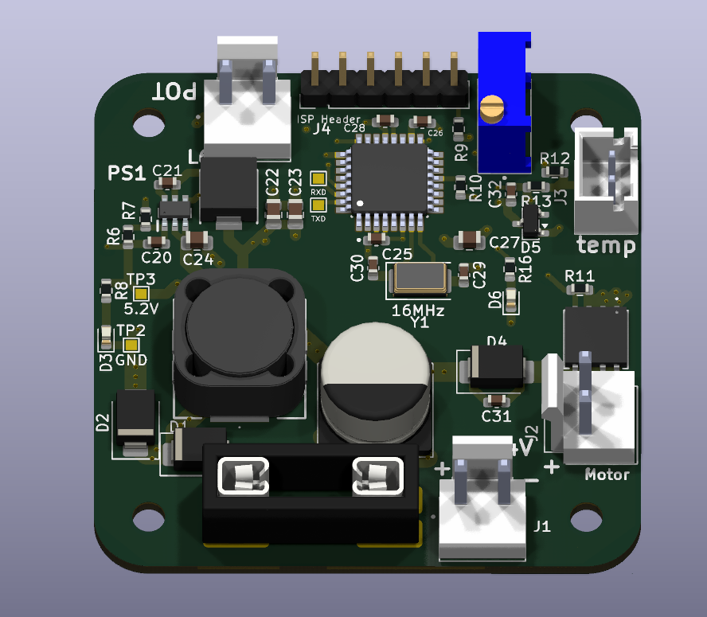

# Adaptive Cooling Pump Controller

A temperature-controlled cooling pump controller for 2-stroke and 4-stroke scooter/moped tuning. Automatically adjusts pump speed based on engine temperature, with manual override and fail-safe fallback built in.

Built by **Arik Nel**.

<!-- n -->

## Features

- **Wide input range (6–24V)** — runs directly off the scooter/moped battery, with protection against overvoltage above 12V
- **ESD protection** against electrostatic discharge
- **Automotive-grade fuse** (5A minimum) protecting the full wiring harness from a board-level short
- **Temperature sensor input**, with control logic handled entirely in firmware
- **Fully programmable microcontroller** — adjust the temperature curve, thresholds, and behavior in software
- **Backup trimpot** — if the temperature sensor is disconnected, the controller falls back to a fixed speed set on the onboard potentiometer
- **External potentiometer input** — connect a potentiometer mounted on the dashboard for manual speed control/override; takes priority over the onboard trimpot, and if disconnected, the controller falls back to the safe onboard trimpot value
- **Status LED** — blinks at a rate proportional to the current PWM duty cycle, giving an at-a-glance read of pump speed

## Hardware

- **MCU:** ATmega328P — fully programmable, ISP-flashable
- **Buck converter:** AP63200QWU-7, automotive-rated input range
- **Motor driver:** AON6354 N-channel MOSFET, low-side PWM switching
- **Input protection:** TVS diode, reverse-polarity diode, automotive fuse

## Hardware

**Pinout ATmega328P-AU:**
- Pulse LED (PD7
- NTC (PTC0)
- Trimpot (PC1)
- Ext. Pot (PC2)

### Programming Connections
| Function | Arduino Uno Pin |
| :--- | :--- |
| RESET | D10 |
| MOSI | D11 | 
| MISO | D12 | 
| SCK | D13 | 
| VCC | 5V |
| GND | GND | 

Which input controls the pump (highest priority first):
1. Overheat: if the sensor reads 95 °C or more, the pump runs at 100%, even if the dashboard pot is connected. It releases below 90 °C. This stops the rider turning the pump down while the engine overheats.
2. Manual: if the external pot is connected, it sets the speed.
3. Auto: if only the temperature sensor is connected, the speed follows the temperature curve: 25% below 50 °C, rising in a straight line to 100% at 85 °C.
4. Fallback: if neither a pot nor a working sensor is connected, the pump runs at 100%. This is the new default you asked for.

How the trimpot range trim works: the firmware reads the external pot as a variable resistor to GND, with a pull-up resistor to 5V. A 20k pot therefore tops out at a lower reading than a 50k pot, and an unplugged pot reads about 1023, which is how the firmware detects that it's disconnected. The trimpot sets which reading counts as full speed, so any pot value can use its whole rotation.

To calibrate: turn the dashboard pot fully up, then turn the trimpot until the LED just reaches its fastest blink.

Other things the firmware does:
- A short 100% start-up burst when the pump starts from standstill, so it doesn't stall.
- A 15% minimum speed while running (the pump may stall below that).
- Gradual speed changes instead of jumps.
- Smoothing on all readings, and a 200 ms delay before a plug or unplug is accepted.
- A 0.5 s watchdog that resets the chip if the firmware hangs.
- The LED blinks faster as the pump speed rises (8 Hz at 100%) and gives a short flash every 2 s when the pump is off.

Check these against your schematic. They're all constants at the top of the file:
- PWM output pin: your pinout doesn't list the MOSFET gate, so I used PB1 (D9), which gives a clean 20 kHz hardware PWM. If the gate is on another pin, tell me which one, because the timer setup would need to change too.
- Sensor wiring: I assumed a 10k NTC (B3950) to GND with a 10k pull-up. Change NTC_* if your parts differ.
- External pot wiring: it must be wired to GND with a pull-up (the rheostat setup above). If it's wired as a 3-wire voltage divider instead, an unplugged pot can't be detected. If turning it clockwise lowers the speed, set EXT_INVERT = true.
- Clock speed: the PWM frequency adapts to 8 MHz or 16 MHz automatically, but the board you pick when uploading has to match your actual clock or crystal. The "Arduino Uno" profile means 16 MHz.
- Watchdog: it's safe when you upload over ISP ("Upload Using Programmer"). Some old Arduino bootloaders get stuck in a reset loop after a watchdog reset.

To see what the controller is doing, set DEBUG_SERIAL to 1. It prints the mode, temperature, raw readings and duty every 0.5 s at 115200 baud.
